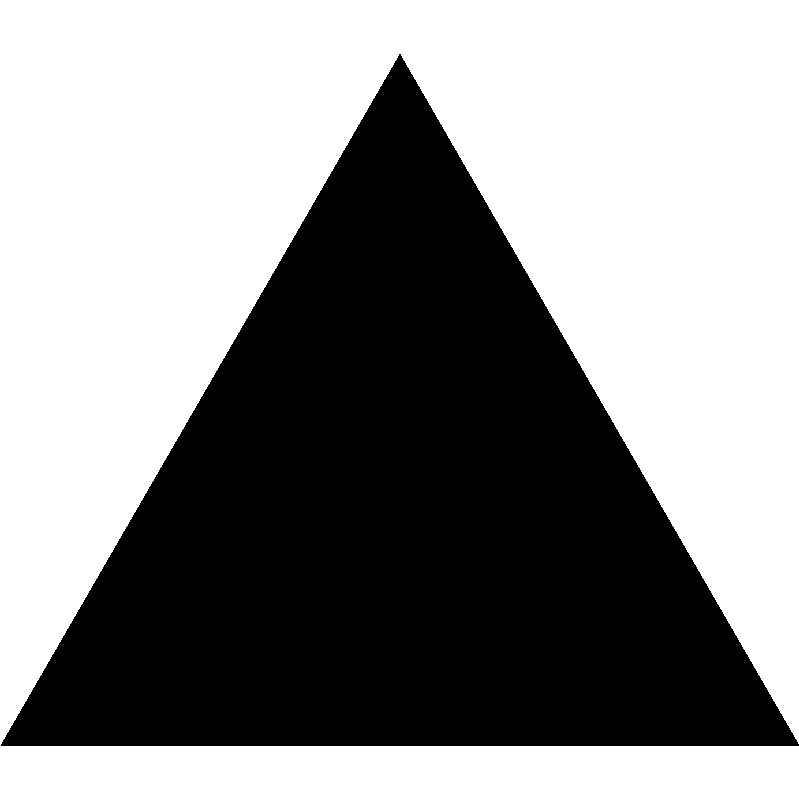
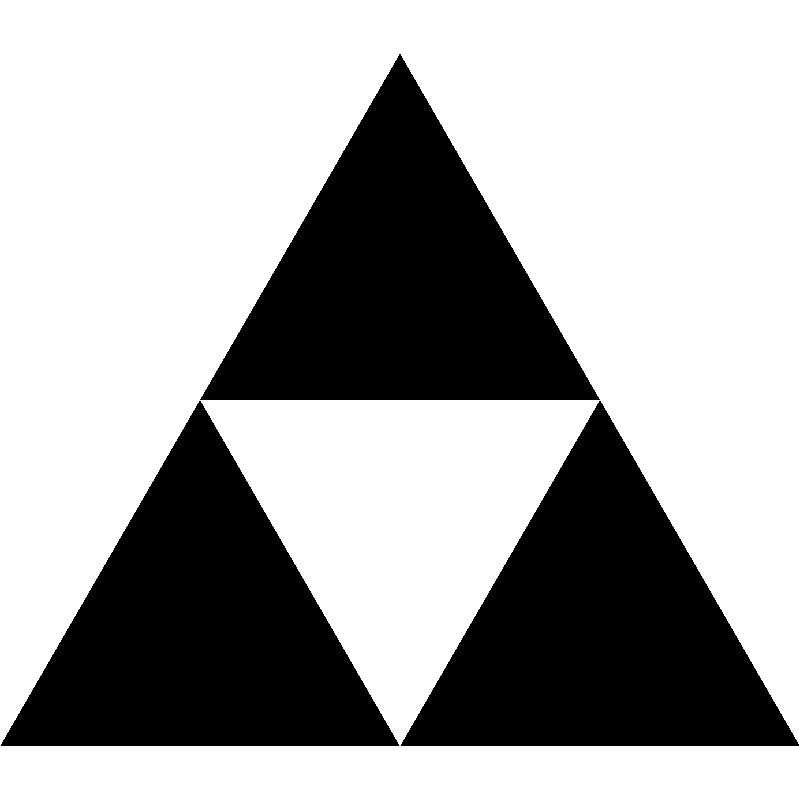
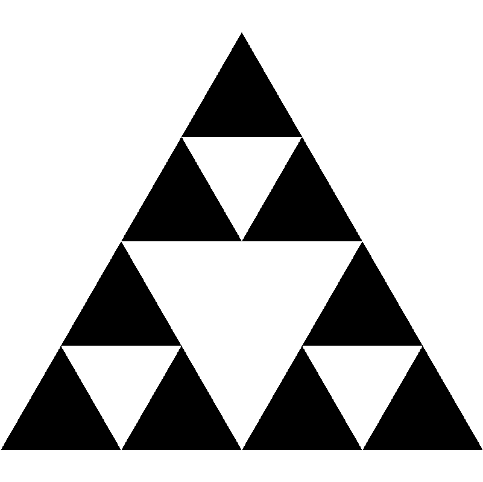
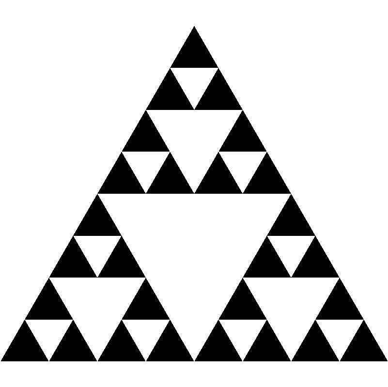
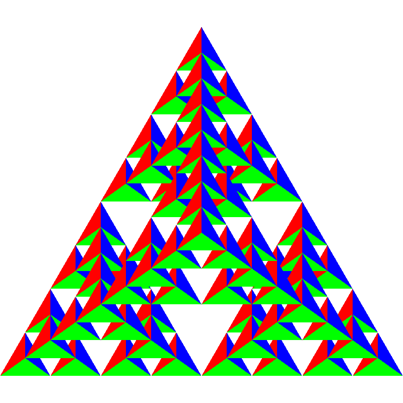

# Exercise 04 <!-- omit in toc -->

## Inhaltsverzeichnis <!-- omit in toc -->
- [1. Written](#1-written)
  - [1.1. Sierpiński-Triangles](#11-sierpiński-triangles)
- [2. Programming](#2-programming)

## 1. Written

**Please** write your solutions into `04_submission.md`. You can use mathematical expression in markdown using Latex syntax, by writing in beetween the dollar expressions ``$` `` and `` `$`` or within code blocks using `math`. These will be rendered in  _Gitlab_ using `KaTeX`:

````markdown
This math is inline $`a^2+b^2=c^2`$.

This is on a separate line

```math
a^2+b^2=c^2
```
````
ergibt:

This math is inline $`a^2+b^2=c^2`$.

This is on a separate line

```math
a^2+b^2=c^2
```

### 1.1. Sierpiński-Triangles

The following picture shows the first four members of the sequence $`T_0,T_1,...`$ of the Sierpiński-Triangles.
Starting with an **equal-sided triangle** $`T_0`$ with area $`A`$, $`T_1`$ is created from $`T_0`$ by decomposing $`T_0`$ into four equal-sided triangles with identical areas as shown, and _"deleting"_ the middle triangle (represented by the white area).
For the three remaining triangles (top, bottom left and bottom right) this process is repeated recursively.

| $`T_0`$                     | $`T_1`$                     | $`T_2`$                     | $`T_3`$                     |
| --------------------------- | --------------------------- | --------------------------- | --------------------------- |
|   |   |   |   |


Let $`A_n`$ be the area of the $`n`$-th Sierpiński-Triangle $`T_n`$ - the white triangles therefore do not enter the area.
1. Establish a recurrence equation for $`A_n`$. (2 point)

    $A_0$ = A

    $A_n$ = $ (\frac{3}{4}) \cdot A_{n-1}$

2. Show by complete induction that $`A_n = (\frac{3}{4})^n \cdot A`$ holds. (2 point)

    assume $A_n = (\frac{3}{4})^n \cdot A$

    prove $A_{n+1} = (\frac{3}{4})^{n+1} \cdot A$

    from recursive equation

    $A_{n+1}$ = $ (\frac{3}{4}) \cdot A_{n}$ and $A_n = (\frac{3}{4})^n \cdot A$

    then

     $A_{n+1}$ = $ (\frac{3}{4}) \cdot A_{n}$ =  $ (\frac{3}{4}) \cdot (\frac{3}{4})^n\cdot A$

     = $A_{n+1} = (\frac{3}{4})^{n+1} \cdot A$


3. What happens in the limit for $`n \rightarrow \infty`$? Determine $` \lim \limits_{n \to \infty} A_n`$. (1 points)

    limit is 0 because the denominator ($4^n$) gets larger and larger when n $\to \infty$


## 2. Programming
You will find in `04.js` the progam and in `04.html` the shader code to render a **2D** Sierpiński triangle in **WebGL**. Convert this so that a colored **3D** view is created. A description of the procedure can be found in the book in section 2.10 ("The three-dimensional gasket"). (5 points)
**Note** the following points:

1. Start by converting the vertices to `vec3`. Instead of the points given in the book, use the following outer points for the tetrahedron:
    ```
    var vertices = [
        vec3(0.0000, 0.0000, -1.0000),
        vec3(0.0000, 0.9428, 0.3333),
        vec3(-0.8165, -0.4714, 0.3333),
        vec3(0.8165, -0.4714, 0.3333)
    ];
    ```
    You should have two `vec3`, one for point locations and one for colors.

2.  Create the function
    ```
    function triangle(a, b, c, color)
    ```
    which creates a triangle from the points `a`, `b`, `c` in 3D and stores it in `points`. Analogously, the color is to be set by assigning the `base_color` with the index `color_index` to each point in `colors`.

2.  Next, create the function
    ```
    function tetra(a, b, c, d)
    ```
    which creates four triangles from the given four points by calling `triangle()` accordingly.

3. Then, create the function
    ```
    function divideTetra(a, b, c, d, count)
    ```
    which, analogous to the book, recursively splits a tetrahedron.
    
4. Finally, the _main program_ and the _vertex shader_ must be adjusted to display the calculated points.
    * Add a variable `in vec3 aColor;` to the vertex shader and use it to set the output color.
    * Make sure in your `gl.BufferData` call you use the correct size for the points you are now passing (vec3 instead of vec2)
    * Create a Buffer called `cBuffer` using `gl.createBuffer()` and call `gl.BindBuffer` and `gl.BufferData` analogous to the way the position buffer is created. Use this to pass color information to the shader.
    * Use `gl.GetAttribLocation`, `gl.VertexAttribPointer` and `gl.EnableVertexAttribArray` to get access to `aColor`, analog to `in_position`.
    * Note: The `flatten()` converts the values to Float32Array, which is used by WebGl in the shaders for handling and passing floating-point data.

The following result should be created after three steps of subdivision:




Total: 10 Points
