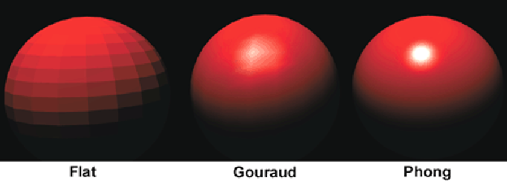

# Exercise 07
### Deadline 18.12.2023

## 1. Written 5P
Explain the differences of Flat Shading, Gouraud Shading, and (Blinn-)Phong Shading given the Figure below. Especially describe which variables get interpolated along the face between the vertices. State for each method if the light calculation is done per face, vertex or fragment and explain the corresponding impact of that to the fidelity of the resulting shading. Write at least one paragraph per shading method.

## 2. Programming 5P
In this task you have to implement flat shading. You will just see a not shaded firgure of a monkey. Implement the TODOS given in the JS code and Vertex shader.

Since complex material properties cannot be easily reproduced in real-time computer graphics, they are usually approximated using the light reflection parameters $k_a$ $k_d$​. These stand for the different light properties Ambient and Diffuse.

$Color = k_a*I + k_d*(N \cdot L)*I$

with $N$=Vertex normal; $L$=Light direction; We only use one light source with color and intensity $I$.

Total: 10 points
