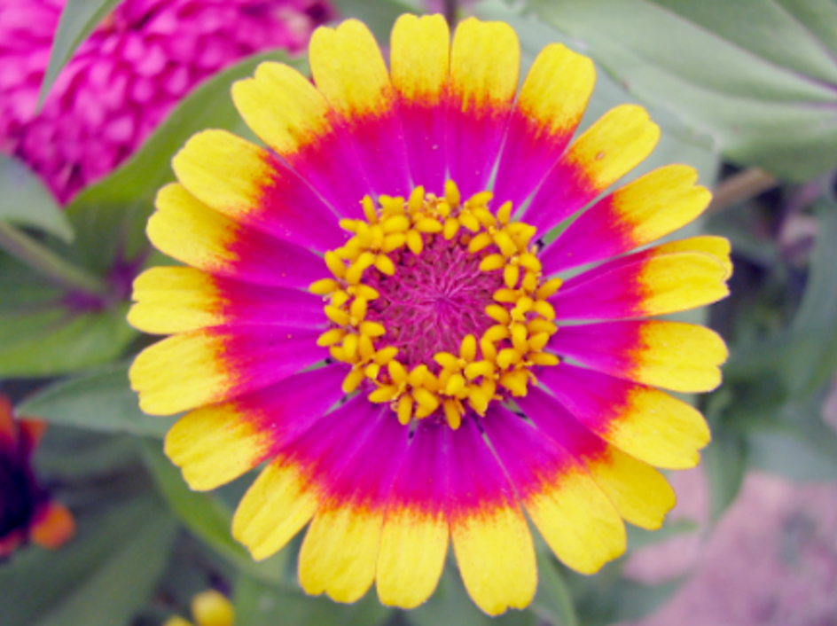
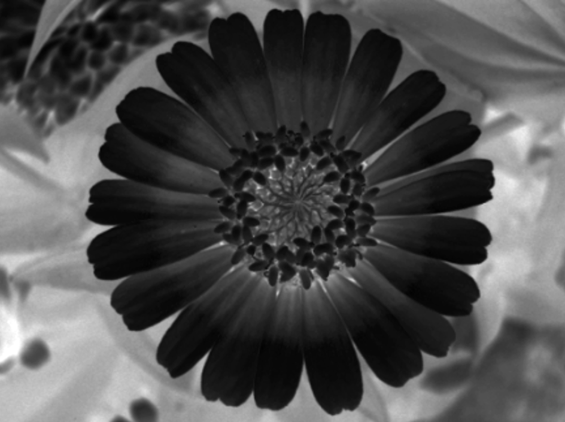
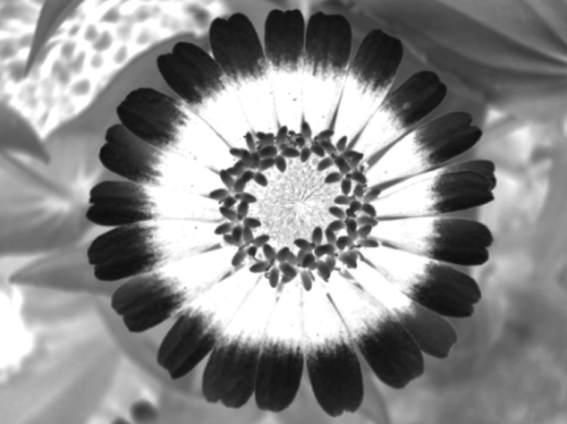
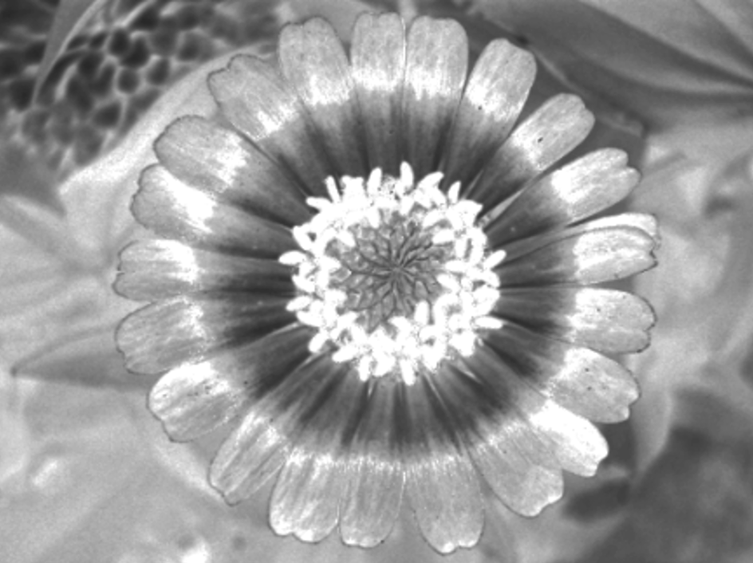
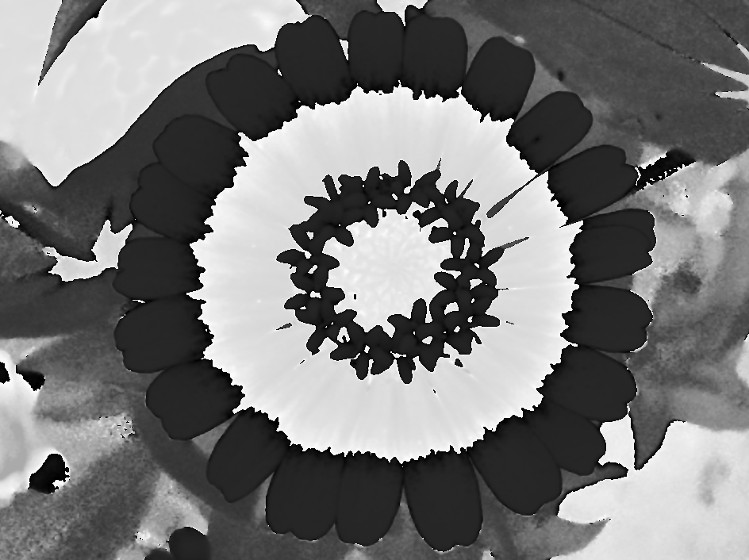
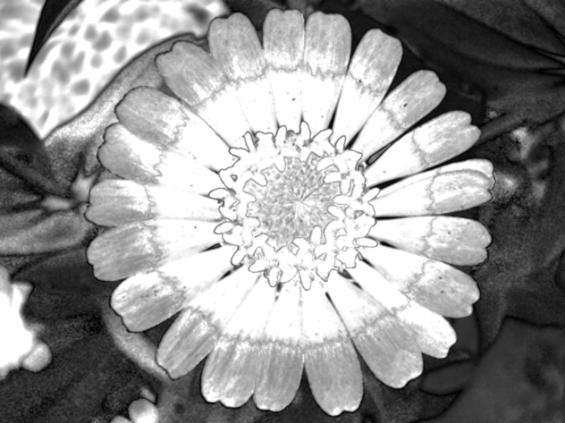
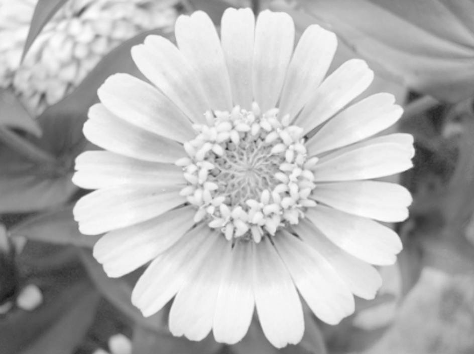
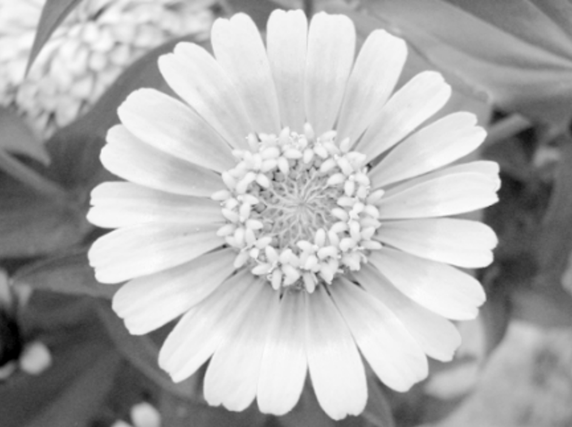
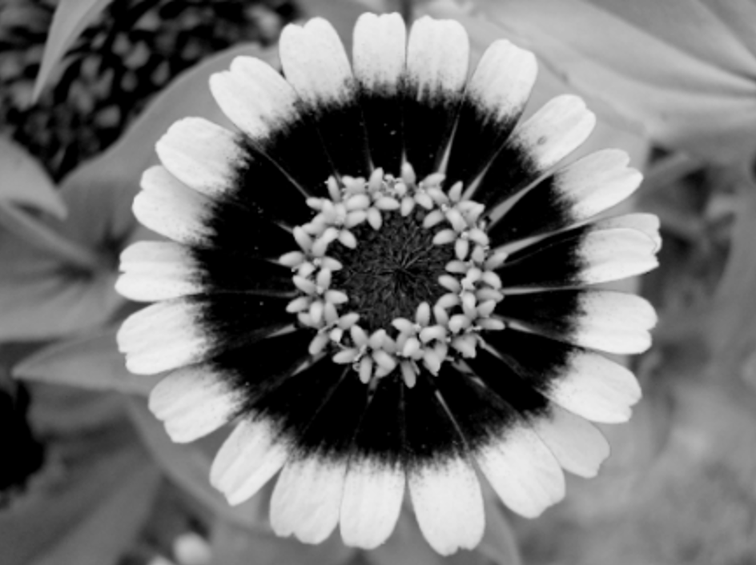
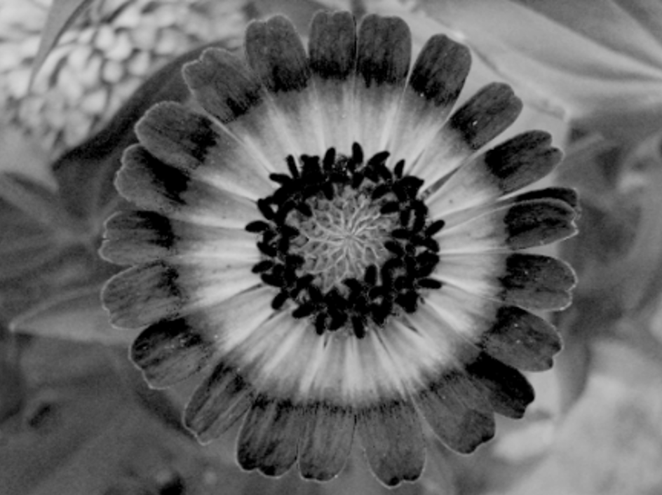

# Exercise 10

## 1. Written
The table below shows the three channels of the different color spaces RGB, HSV and CMY for figure a). The channels of the color spaces are given in this order!
* Assign each row of 3 channels to the appropriate color model and **justify** your choice in at least one paragraph per color space. Don't argue by exclusion for the last one! Dark pixels in the images represent a small portion of the respective color component, white is accordingly a high color component. (5 points)

| Figure a)                         |
| ------------------------------------ |
|  |

|            | channel_1               | channel_2               | channel_3               |
| ---------- | --------------------- | --------------------- | --------------------- |
| Color Space_1 |  |  |  |
| Color Space_2 |  |  |  |
| Color Space_3 |  |  |  |

## 2. Programming

Different color models and their corresponding color spaces have different advantages and disadvantages when it comes to working with colors. To use these advantages it is often important to convert a color from one color space to another. The HSV color space, for example, offers a much more intuitive approach to changing the saturation and brightness of a color. Implements two methods in the fragment shader that realize this conversion: (5 points)

- `highp vec3 RGB2HSV(highp vec3 rgb)`
- `highp vec3 HSV2RGB(highp vec3 hsv)`

For this exercise, we will continue to use the Monkey object.

The RGB color present in the shader via WebGL is to be transformed into the HSV color space and can be changed via slider input. All three components of a HSV color (Hue, Saturation and Value) shall be adjustable. After the change to the HSV color space, the color shall be transformed back to the RGB color space and used as the final color. The slider input can be stored e.g. in a vec3 and added as offset to the calculated HSV values. For this, the offsets managed in the CPU code must be passed to the shader on the graphics card.

In the shader, the variables provided by the CPU are available as `uniform` variables. The offsets in the shader are then accessible via the uniform `u_hsv_user_input`. To be able to change the HSV values interactively, the offsets must be passed to the shader in the render loop. Make sure that after adding the offset to the HSV values, they are still inside the correct range for HSV values. You can use the `mod` function to restict hues to 0° - 360° and  `clamp` in GLSL to restrict the saturation and value.

The specular refelections might have different colors than the rest of the lighting.

Total: 10 points
