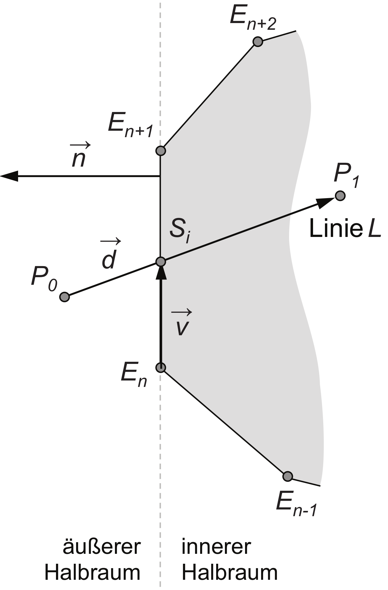

# Exercise 11

### Deadline 29.01.2024

## Written
This assignment is about _clipping_, that is, trimming a geometric figure to a given section. We are interested in how two-dimensional lines can be clipped to the section that is inside a given polygon.

As an example, consider the situation shown in the figure on the right. The line $`L(t) = P_{0} + t \cdot \vec{d}`$ intersects the polygon edge $`\overline{E_{n}E_{n+1}}`$. How can the intersection point $`S_{i}`$ be determined? Derive the corresponding expression. 

**Note**: Make use of the normal $`\vec{n}`$, the vector $`\vec{v}`$ and their orthogonality. Find a suitable value for $t$.

(5 points)

## Programming
Culling and clipping are techniques for discarding geometry that is not currently needed. Both procedures thereby relieve the following stages of the graphics pipeline when generating images in real time. Both clipping and culling usually require more sophisticated procedures. The simplest type of culling, however, can be implemented using a geometric condition. With the normal $`\vec{n}`$ of a surface of an object and the view vector $`\vec{v}`$ from the object to the camera, the dot product of the two vectors $`\vec{n} \cdot \vec{v}`$ to determine the visibility of a surface. Values greater than $`0`$ indicate visible surfaces.

Implement this form of culling in the fragment shader. All fragments that are currently not visible should be discarded.

For this you have to calculate the dot product (`dot()`) in the fragment shader and discard non-visible fragments using `discard;`.

**Note**: To see the effect of your culling, activate the wireframe rendering via the checkbox.

(5 points)

Total: 10 points

